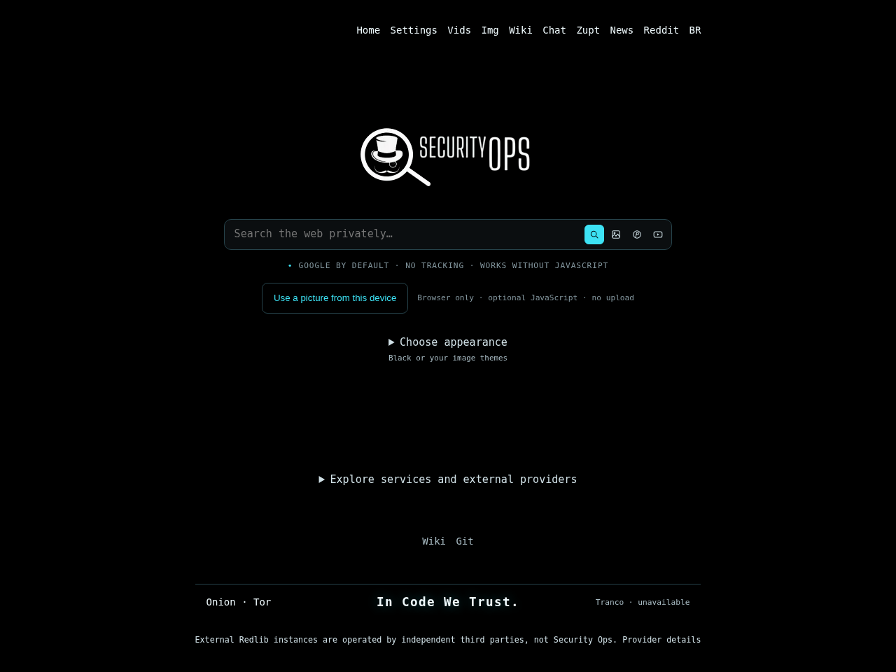

# SecuritySearch v0.9.27

## v0.9.27-r1 deployment repair

The readiness gate now validates asset **31**, matching the actual PHP source and
configuration generator; its old asset-30 expectation incorrectly rejected correct
candidates. All previous checks remain, plus a source-derived version regression.
Use the matching **securitysearch-update-0.9.27-r1** kit on an exact clean applied
v0.9.27 checkout. Application version and the existing v0.9.27 tag name do not
change; existing conflicting tags are preserved. [Repair details](docs/AUDITFIX-0.9.27-r1.md).

[English](README.md) · [Português do Brasil](README.pt-BR.md)



Local Chromium capture of this release's PHP-generated Black homepage. Bundled
resources are embedded in the capture fixture because this authoring browser blocks
localhost navigation. This is not a new production capture, a Lighthouse run, or a
performance result. [Mobile capture](docs/screenshots/securitysearch-0.9.27-mobile.png).

A privacy-oriented PHP search proxy based on [4get](https://git.lolcat.ca/lolcat/4get),
maintained by Security Ops. **Works without JavaScript** for normal searches and
bundled themes. Local pictures and image enhancements use optional same-origin
scripts. No provider can guarantee every query or every request.

## Google web and image reliability

The existing Google/CSE integration now parses bounded, inert JSONP prologues,
validates result records independently and follows the explicit numeric next-page
offset supplied by Google. Zero/invalid thumbnail heights no longer cause division
by zero. Malformed optional text or image metadata cannot abort otherwise valid
records. Broken entire result sets are still errors, not successful empty pages.

Cold session initialization first uses Google's documented query-free `cse.js`
loader. A supported loader response needs one fewer bootstrap request. An unfamiliar
loader format may use one bounded legacy discovery path; refusals, challenges and
rate limits do not trigger that recovery. Script contents are parsed as bounded
JSON, never executed. A valid cached session or continuation avoids bootstrap work.

Concurrent refreshes recheck the cached token after acquiring the session lock, so
one worker does not discard a successful replacement from another. A waiter compares
the actual rejected token rather than relying on flight bookkeeping. No search
results, queries, visitor cookies or credentials are added to shared caches.

Web thumbnails and both small/large image previews retain actual provider URLs;
originals remain available. Valid empty result lists stop normally. Pagination keeps
its provider. The existing Google-to-Brave first-page fallback, total deadline,
refusal cooldowns, SSL verification and response limits remain.

These are reproduced adapter defects and offline fixes, not proof of why every
reported live search failed. Provider restrictions, outages or a different future
response format can still result in a clearly identified failure.

## Homepage work in v0.9.27

A small shared renderer now serves the homepage without loading the full search
results class. At container startup, fixed public template/CSS strings and theme
metadata are compiled into a deployment-owned resource bundle for existing OPcache.
Requests still render their own preferences, theme controls and current footer.
**No rendered page, query, cookie, result set or local/private image is shared.**
Unneeded style/footer fragments are skipped only where the template has no place
for them; no visible feature is removed. The output, Black critical CSS, banner,
forms and image behavior remain the same. Compilation failure or an explicit
`SECURITYSEARCH_RENDER_BUNDLE=0` uses the working dynamic path.

The homepage reports `X-SecuritySearch-Render: compiled` or `dynamic`, plus its
existing query-free `Server-Timing: app;dur=...`. Responses remain private/no-store.
The bundle is rebuilt before Apache starts; source edits need regeneration and
process replacement. No NPM, shared response cache or security bypass is introduced.
[Performance operations](docs/PERFORMANCE-0.9.27.md) explain the boundary and rollback.

Optional read-only origin check after deployment, from the extracted kit:

```fish
fish ./diagnose-delivery.fish
```

This observes three localhost homepage requests through the existing container;
it sends no search and does not restart or reconfigure services. Its private JSON
in `~/Downloads` separates PHP work, local transfer and compression. It is not a
public-site speed score. No result against 4get.ca or global speed claim is asserted.

## Manual benchmark script (results not published)

The user-supplied [SecOps Web Benchmark 3.0.0](tools/secops-web-benchmark-v3.fish) is
included byte-for-byte as a standalone manual tool. **No comparative benchmark is
run during installation, deployment, automated audits or this update's preparation.**
No leaderboard, winner badge, benchmark reports or comparative performance claims
are included. Add independently measured results later, with their method and limits.

On GNU Guix, from an existing checkout, run later:

```fish
fish --no-config "$HOME/securitysearch/tools/secops-web-benchmark-v3.fish"
```

For an already installed Python/curl toolchain:

```fish
fish --no-config "$HOME/securitysearch/tools/secops-web-benchmark-v3.fish" --system-deps
```

The default is 21 measured rounds, one excluded warm-up round and a one-second pause.
Reports stay under `~/Downloads/securityops-benchmarks/`. The Guix mode uses a
temporary dependency environment, not a system reconfiguration. This measures
**HTTP homepage HTML delivery only**: not browser LCP, CSS/image delivery,
Google query latency or search quality. Differences can be dominated by geography,
DNS/TLS, infrastructure, cache state and observation time. There is no claim that
SecuritySearch is globally faster than 4get.ca or any other service.

## Preserved features and ownership

News RSS remains the default, using bounded Google/Bing headline/search feeds.
Reddit is optional: **external Redlib instances are operated by independent third
parties, not by Security Ops**. Security Ops maintains the integration, not those
instances or their policies and availability. The About page and UI keep this notice.

Binternet image search, six image layouts, animated-preview controls, ordinary
pagination, optional infinite scrolling, the onion link and dated Tranco metadata
remain. My picture reads and normalizes a selected file in the browser, outside
forms, with session-only storage by default and explicit persistence/removal options.
The picture, animated-preview and RSS runtime implementations are unchanged.

Historical Lain/SecOps artwork stays in the external operator pack, not source
commits or public releases on any forge, including Codeberg. Reuse that pack only
with `--theme-assets` on private deployments. The shared code retains its public
fallbacks. **In Code We Trust.**

## Apply, validate and deploy

From the extracted complete `securitysearch-update-0.9.27-r1` kit, on a clean exact
already-applied v0.9.27 checkout:

```fish
fish ./apply-securitysearch.fish "$HOME/securitysearch"
and fish ./deploy-securitysearch.fish "$HOME/securitysearch" \
    --theme-assets "$HOME/.local/share/securitysearch/operator-themes-v1" \
    --verify-google \
    --rank-refresh
```

This creates a normal commit and preserves local work, existing tags, source-release
assets and backups. Deployment uses `root@securityops.co`, SSH port 5119, the existing
Docker binding/networks and Nginx Proxy Manager upstream. Keep the complete kit
together; older manifest-based launchers do not accept the updated source.

All offline suites, candidate readiness, fresh RSS headlines plus keyword search,
and live Binternet remain mandatory. The explicit `--verify-google` option additionally
requires nonempty **Google web AND image** results from the candidate before cutover.
No Brave fallback qualifies as Google success. A first-probe failure stops further
Google probing and leaves production in place; `google-live.json` holds sanitized
status/count/error evidence in the printed backup directory. Passing two neutral
queries is not proof of all-query availability or a latency benchmark.

## Publish v0.9.27

```fish
fish ./publish-securitysearch.fish "$HOME/securitysearch"
# Retry only .com.br, including release tarball and checksum:
fish ./publish-securitysearch.fish "$HOME/securitysearch" --host git.securityops.com.br
```

Publication creates/reuses a new annotated `v0.9.27` tag, complete tagged-source
`securitysearch-v0.9.27.tar.gz` and its `.tar.gz.sha256`. It never retargets v0.9.26
or replaces different published assets. Tokens are entered privately, and Forgejo
attachments use multipart uploads. Operator pictures never enter the public package.
The published
v0.9.24 tag remains unchanged, as does v0.9.25. Earlier releases and history remain. Publishing does not deploy the VPS.

[Release notes](docs/RELEASE-0.9.27.md) · [Audit](docs/AUDIT-0.9.27.md) ·
[Upstream review](docs/UPSTREAM-0.9.26.md) · [License: AGPL-3.0](license.txt)

## Tests and boundaries

```sh
sh scripts/test.sh --keep-going
```

The 71 mandatory commands retain every earlier suite and add compiled-resource/HTTP
parity, read-only diagnostic and release/package checks. The competitive
benchmark above is deliberately not part of this runner. Native PHP curl, DOM/XML,
mbstring, APCu and Imagick, plus Python, Node, Git and fish, are required. Missing
dependencies are failures, not passes. Test doubles are identified explicitly;
no mocked provider response is evidence of live availability. The audit records
executed results and limits. Live VPS/forge operations are separate operator actions.
