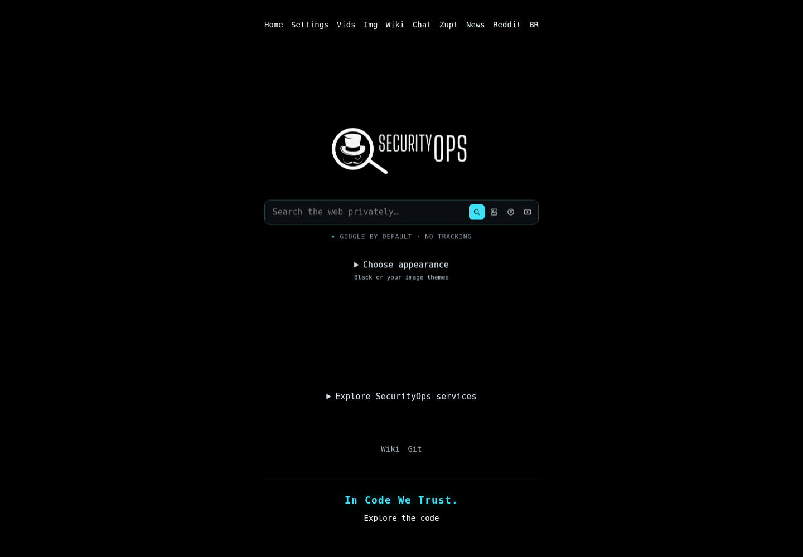
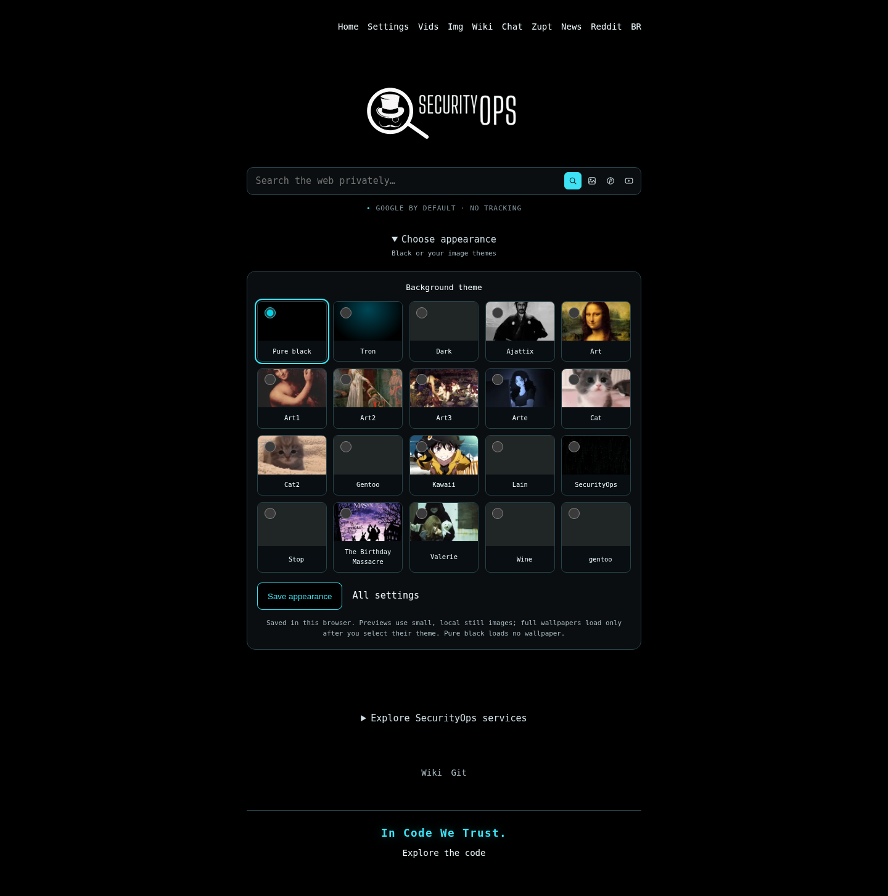

# Security Search v0.9.20

[English](README.md) · [Português do Brasil](README.pt-BR.md)



Local rendering of this release, not a screenshot of the deployed VPS. The HTTP controller was exercised locally; Chromium rendered its HTML with bundled resources embedded for the isolated preview. Asset version: **24**.

Security Search is a PHP search proxy based on [4get](https://git.lolcat.ca/lolcat/4get), maintained for [SecurityOps](https://securityops.co/). Search providers remain external services: a working adapter cannot guarantee their availability.

## This update

Binternet accepts the older `img-container`/`img-result` markup and the newer `image-gallery`/`image-link` layout. Both root-relative and page-relative proxy/pagination links work. Query validation now follows the newer service's 160-byte UTF-8 limit rather than measuring 64 HTML-escaped bytes. Bookmarks up to 4096 bytes are supported; foreign hosts, unsafe URLs and repeated pagination cursors are rejected. Recognizable empty results are distinct from broken/blocked pages.

Fast previews use the smaller image actually returned by Binternet, while preserving the original URL and dimensions. No larger thumbnail URL is fabricated. The fixed service origin remains `https://images.securityops.co`; this release does not guess that the separate navigation host `img.securityops.co` is interchangeable.

Legacy cURL calls now share a request-local deadline: by default, 3 seconds to connect, 12 seconds per call and 20 seconds across those calls. DNS and TLS-session state are shared within one PHP request, never cookies or search results. Baidu's multi-request loop waits instead of spinning continuously. Google CSE and Brave retain their separate bounded transports and the existing first-search fallback policy. These are bounded waits and local optimizations, not measured claims about live provider speed.

Pure black is the new instance default. **Choose appearance** restores native, keyboard-accessible theme selection with small previews of existing image assets. Saved browser themes still win over the default. The homepage remains JavaScript-free; wallpaper is loaded only for the selected image theme. The twelve new still previews total about 45 KB.



## Existing behavior retained

The four search actions remain inside the search bar: Search, Search Image, Search Pinterest and Search YouTube. Image search retains six layouts, preview/high/original quality choices, format filters, manual pagination, optional infinite scrolling and bounded animated previews. Only image search permits the two local enhancement scripts. The services disclosure, API routes, native links and **In Code We Trust.** footer remain.

Google stays the default web/image provider. A failed first Google search can try Brave once with a visible notice; continuation requests do not silently change provider. Reddit uses the configured Redlib service and YouTube uses Invidious. Their availability has not been established by this patch.

## Release v0.9.20

This release includes the **r1 offline-audit repair** and keeps application version
**0.9.20** / asset version **24**. The four cURL test doubles are conditionally
registered, partially configured isolation is rejected, and deployment prints a
bounded audit-failure tail while retaining the complete log. Production cURL is
not disabled. [Repair details](docs/AUDITFIX-0.9.20-r1.md).

### Packages

[Codeberg release](https://codeberg.org/berkeley/securitysearch/releases/tag/v0.9.20) ·
[GitHub release](https://github.com/cristiancmoises/securitysearch/releases/tag/v0.9.20) ·
[SecurityOps .co](https://git.securityops.co/cristiancmoises/securitysearch/releases/tag/v0.9.20) ·
[SecurityOps .com.br](https://git.securityops.com.br/cristiancmoises/securitysearch/releases/tag/v0.9.20)

Each completed release provides **`securitysearch-v0.9.20.tar.gz`** and its
**`.tar.gz.sha256`** checksum. The package is the complete tagged PHP source,
including documentation, tests and bundled assets—not a prebuilt Docker image or
native executable. A release link is available only after that host's publication
has completed.

```sh
sha256sum -c securitysearch-v0.9.20.tar.gz.sha256
tar -xzf securitysearch-v0.9.20.tar.gz
```

### Update an existing installation

Apply/deploy the repaired **`securitysearch-update-0.9.20-r1`** kit before using the
publication kit. Do not use the original, unrepaired v0.9.20 kit or the old v0.9.19
publication launcher.

Deployment uploads committed source over SSH **5119** to **root@securityops.co**.
The updater retains the existing **172.17.0.1:5140 → 80** binding and Docker
networks; unsupported layouts are refused instead of changing Nginx Proxy Manager.
The full isolated offline suite, candidate readiness and a real Binternet check
must pass before cutover. Retain the printed backup directory: it may hold
private-data snapshots mounted by the new container.

### Maintainer publication

From the extracted **`securitysearch-publication-0.9.20`** kit:

```fish
fish ./publish-securitysearch-v0.9.20.fish ~/securitysearch
```

The launcher verifies the exact r1 baseline, updates the English/pt-BR READMEs and
release documentation, commits only those intended changes, runs the publication
regressions, creates an annotated **`v0.9.20`** tag and packages that exact commit.
It then asks for four private tokens and preflights every repository before the
first remote write. On each host, `main` and the tag are pushed atomically without
force. Release assets are uploaded to a draft, verified, and then published.

A repeat run resumes matching drafts and missing hosts. Conflicting tags, notes or
assets are never replaced. Publication across four servers is not atomic. A local
incremental Git bundle is also produced for recovery; it requires the published
v0.9.19 baseline. Tokens are not stored in files, URLs or command arguments.

**Publication does not deploy the VPS.** After this documentation commit, the old
r1 launcher's exact README hashes no longer match; use the matching
`deploy-securitysearch.fish` in the publication kit for any subsequent deployment.

[Release notes / Notas da versão](docs/RELEASE-0.9.20.md) ·
[Publishing guide](docs/PUBLISHING-0.9.20.md) ·
[Publicação em português](docs/PUBLISHING-0.9.20.pt-BR.md) ·
[Operation details](docs/UPDATE-0.9.20.md) ·
[Detalhes em português](docs/UPDATE-0.9.20.pt-BR.md) ·
[Audit limitations](docs/AUDIT-0.9.20.md)

## Tests

```sh
sh scripts/test.sh
```

Requires PHP with curl, DOM/XML, mbstring, APCu, sodium, fileinfo and Imagick, plus Python 3, Node.js, Git and fish for tests. The production image does not gain Python/Node/fish: those dependencies are installed only in its disposable audit derivative.

For a separate, explicit live provider matrix after deployment, run `fish ./audit-providers.fish` from the patch kit. It makes one neutral `teste` search per enabled provider/page combination, sequentially. An unavailable or empty provider is not counted as a successful search. Results, credentials and pagination tokens are not dumped into the JSON report.

Local authoring did **not** execute Docker, the extension-dependent PHP suites, or live VPS/provider requests. See the audit report for passes versus dependency blockers. Historical v0.9.19 tools remain available for that release. The v0.9.20 publishing tools are `scripts/package-v0.9.20.py` and `scripts/publish-v0.9.20.py`; the publication kit coordinates them.

License: [AGPL-3.0](license.txt).
