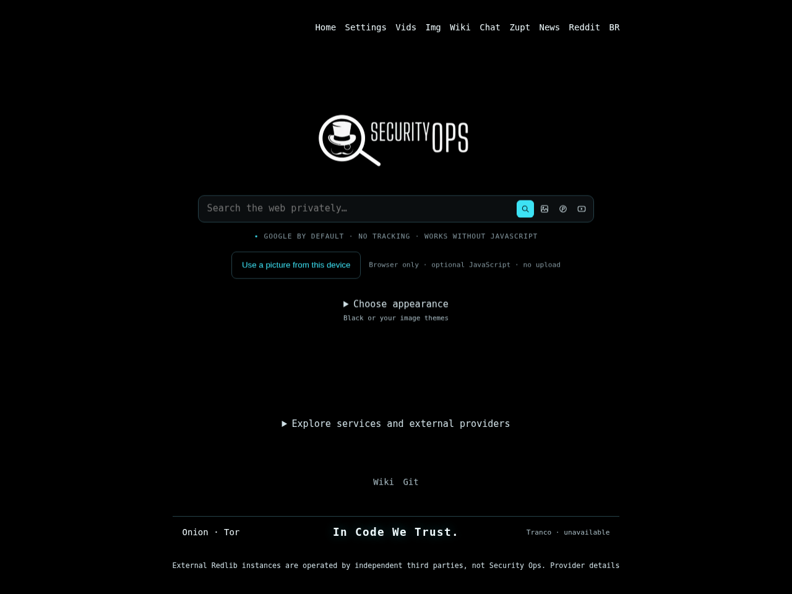

# SecuritySearch v0.9.42

[English](README.md) · [Português do Brasil](README.pt-BR.md) · [Documentation](docs/INDEX.md)



Historical v0.9.36 local Chromium capture with networking blocked. It is not a current
production screenshot, live search result, or performance score.

SecuritySearch is a privacy-oriented PHP search proxy based on [4get](https://git.lolcat.ca/lolcat/4get),
maintained by Security Ops. Web, images, video, RSS news and music retain their provider integrations.
Core search, filters, pagination and bundled themes work without JavaScript. Optional same-origin
scripts implement image animation, infinite scrolling and the browser-local My Picture background.
No query history, advertising, external analytics or provider-unavailability-as-success is added.

## What is new

| Area | Current behavior |
|---|---|
| Version | Release **0.9.42**, static assets **42**. |
| Images | **DeviantArt via SkunkyArt**: native shortcut, original artwork links, signed previews, orientation/AI-label/Safe Search filters and bounded pagination. |
| Required acceptance | **130 native commands**, with all 124 v0.9.41 commands as an exact prefix, plus genuine Google **Web and Images**, RSS, Binternet and SkunkyArt live results. HTTP 200 with a provider error does not pass. |
| Original versioned release workflow | One native audit → live gates → cutover → independent verification → old-build cleanup. No mandatory separate audit-only run or pre-build deletion. |
| Performance | The v4 benchmark ranks **TTFB**, separately from total HTML time; v3 remains byte-identical. Bounded labels, observer-based scrolling and safe static-home delivery are retained. No universal speed win is claimed. |

SkunkyArt uses `https://skunkyart.securityops.co`, not the earlier `securiyops.co` spelling,
and owns its DeviantArt authentication. Provider availability and metadata are not guaranteed.
After verified success, scoped retention removes recognized old stopped containers, including
the old rollback, owned unused images and old upload archives. **The old container rollback
option is lost after cleanup.** Running services, retained images, volumes, networks, extracted
source, private backups, source history and NPM are not cleanup targets.

The historical v0.9.40 audit expanded to 119. Earlier results, including 124/0, do not approve a new
candidate: it requires its own complete **130/0** evidence and live acceptance.

## Provider reliability

The reliability corrections retain version **0.9.42**.
Google CSE failures use controlled classifications instead of reflecting upstream error text.
The five search API routes catch initialization, filter and provider exceptions and PHP errors, returning HTTP 503,
`Cache-Control: no-store`, `Retry-After: 30` and a JSON `status` message without internal details.

Brave's Svelte data decoder accepts literal data and closed IIFE parameter bindings without
executing JavaScript. It rejects unknown expressions and bounds input/expanded strings to
4 MiB, nesting to 64 levels and parsed values to 100,000 nodes. Missing result structures and
nonempty image lists with no usable records are failures, not fabricated empty success.
Genuine empty lists and legitimate image-format filtering remain valid.

Pexels, Unsplash and Pixabay have explicit proxy configuration defaults. `false` means a direct
connection; operators can select their own existing pool instead. Older private configurations
must add missing settings without replacing their other values. No implicit direct fallback is added.
Unsupported Archive.org video and Yep news choices are removed; Yep web remains available.
Cara validates response and image records before using them, preserving genuine empty lists and
returning a controlled format failure for malformed data.

### Evidence — 2026-10-03

| Verification | Result and limit |
|---|---|
| Focused offline regressions | Google/API error contracts and Brave parsing are verified; this is not live provider acceptance. |
| Complete native audit | All 130 required commands passed with zero failures. Native audit evidence is separate from live provider availability. |
| Google and Brave in a real browser | Google Web and Images each returned 20 results. Brave returned 20 web results, 20 on the second page and 200 images. HTTPS and browser sandbox checks passed; these are specific searches, not a permanent availability guarantee. |
| Service searches after the final cutover | Newswire returned 40 news entries and SkunkyArt 23 images. A Binternet request timed out; a later, separate check returned 24 images and 24 on the second page without a restart. The failed check remains recorded and is not counted as success. |
| Additional image providers | Pexels returned 24 images and Pixabay 100. Unsplash returned an upstream HTTP 307 redirect that was not followed; Cara returned upstream HTTP 401. Neither unavailable integration is reported as working; their public API responses are controlled HTTP 503. |
| Captured Brave response replay | 20 web records decoded and rendered; 167 image records decoded and parsed as usable images. Network-disabled replay makes no new provider requests and does not verify native upstream transport. |
| Browser API checks after service-network repairs | Binternet returned 25 images and SkunkyArt 23, both with continuation tokens, HTTPS 200 and valid TLS. These checks cover those searches, not every provider or query. |
| 57-check provider snapshot before code replacement | 27 returned results, 4 returned empty responses and 26 were unavailable. This is not an all-providers-working claim. |
| Google JSON API | Requires an operator-supplied API key; it is inactive without one. Google CSE is a separate integration. |
| Acceptance requirements | Complete 130/0 native audit, genuine mandatory live results, guarded cutover and independent source/image verification before publication. The checks above do not substitute for these requirements. |

Proxy DNS, container networking, stopped services and upstream restrictions require separate
operational checks; parser fixes do not establish that those problems are resolved. See
[provider troubleshooting](docs/TROUBLESHOOTING-0.9.42.md).

## Upgrade, audit and deploy

The self-contained v0.9.42 deployment and publication kits describe the original, tree-pinned
release; they do not contain later maintenance commits on `main`. Do not reapply a frozen kit to
an updated checkout or claim that it deployed current `main`. Keep kits, tree allowlists and
immutable release tags unchanged.

For maintenance, stage the reviewed current source and required private operator resources on
the Docker host. The existing `scripts/deploy-ionos.py` builds the source tree containing it and
requires the native Docker/PHP audit runtime on the VPS; explicitly set
`SECURITYSEARCH_VERIFY_GOOGLE=1`. This is not the full one-shot release installer. Independent
post-deployment source/image/evidence checks and scoped post-success cleanup are separate steps.
The versioned launcher commands below apply to the original release workflow.

Use a full, clean `main` checkout in `~/securitysearch`; downloads remain in `~/Downloads`.
The observed GitHub baseline is v0.9.40-r2, tree `b0ab9966f02dd0c41ad8f936347b64cee5642c9f`.
The cumulative updater also supports corrected v0.9.30 tree
`488b01ae481e8e4e95dad3743c2a175c43065c97` plus the exact original v0.9.41 and v0.9.41-r1 trees.
It checks the tree, not just a version string. Unknown, shallow, non-main or dirty work is refused.
It does not reset, stash, rebase, amend commits, force-push or discard existing work.

Local requirements are Fish, Python 3, Git, OpenSSH and coreutils. Deployment needs no local PHP or
Docker. It uses `root@securityops.co:5119`, the existing `security-search` Docker container and the
private pack `~/.local/share/securitysearch/operator-themes-v1`. Keep SSH host-key verification enabled.

Save the self-contained launcher and matching checksum in `~/Downloads`, then run:

```fish
begin
    cd "$HOME/Downloads"
    and sha256sum --check securitysearch-v0.9.42-deploy-ionos.fish.sha256
    and fish --no-config --no-execute "$HOME/Downloads/securitysearch-v0.9.42-deploy-ionos.fish"
    and fish --no-config "$HOME/Downloads/securitysearch-v0.9.42-deploy-ionos.fish" --check-only
    and fish --no-config "$HOME/Downloads/securitysearch-v0.9.42-deploy-ionos.fish"
end
```

`--check-only` is read-only with no SSH. `--prepare-only` creates only the ordinary local update commit.
The default invocation uploads/builds once and audits once on IONOS, then automatically proceeds
through genuine provider checks, production replacement, independent verification and retention.
It does not publish Git refs. There is no need to run `--audit-only` first.

`--audit-only` remains available for deliberate investigation. It may commit/upload/build but does
not replace production, contact providers or remove old objects. A later normal deployment is a
new execution and repeats its audit rather than reusing a partial receipt.

A 429, CAPTCHA, empty or fallback result, missing prerequisite, source drift or partial log blocks
cutover. Old containers/images/archives are not cleaned on an unsuccessful candidate run. After
verified success, partial cleanup is reported separately and never triggers rollback of an accepted
service after the old rollback has been deleted. There is no global prune or forced image removal.
See [retention policy](docs/RETENTION.md) for exact filename and resource boundaries.

## Commit and publish to four remotes

Only after `DEPLOY COMPLETE`, use the matching new publisher:

```fish
begin
    cd "$HOME/Downloads"
    and sha256sum --check securitysearch-v0.9.42-publish-four-remotes.fish.sha256
    and fish --no-config --no-execute "$HOME/Downloads/securitysearch-v0.9.42-publish-four-remotes.fish"
    and fish --no-config "$HOME/Downloads/securitysearch-v0.9.42-publish-four-remotes.fish"
end
```

The publisher independently verifies deployed source/image identity and complete current evidence
before pushing `main`, immutable annotated `v0.9.42`, release notes and source/checksum assets to
GitHub `cristiancmoises/securitysearch`, Codeberg `berkeley/securitysearch`, and
`git.securityops.co/cristiancmoises/securitysearch` and `git.securityops.com.br/cristiancmoises/securitysearch`.
Tokens are entered privately, not saved or embedded in URLs. Conflicting tags/assets are refused.
Four-host publication is not atomic; matching partial work can be reconciled with `--host`.
`--verify-only` verifies without publishing. The published
v0.9.24 tag and later historical tags are not moved.

## Diagnostics, benchmark and privacy

The standalone `securitysearch-audit-diagnostics-0.9.42.fish` collects allowlisted audit evidence;
`--explain-latest`/`--explain-report FILE` are offline. Reports are private, source remains explicitly
unverified by diagnostics, and collection success never authorizes deployment or publication.
Retain the older reader for older tree-pinned reports. Do not share effective configuration or tokens.

Run `sh scripts/test.sh --keep-going` in the native test runtime. Missing Fish, PHP extensions or
Alpine/FPM prerequisites fail rather than skip. Audit capture is bounded to 8 MiB / 1,800 seconds;
this is not a build/upload deadline. The separately delivered validation report lists actual runs.

Run `fish tools/secops-web-benchmark-v4.fish --self-test` for an offline check. A normal invocation
performs real sequential homepage requests to seven targets and saves HTML/CSV/JSON reports under
`~/Downloads/securityops-benchmarks`. It is never run automatically by audit or deployment. Same
machine/network/time results are not a ranking of every search engine or of search-result quality.

External Redlib instances are run by independent third parties, not by Security Ops. My Picture does
not upload pictures, filenames or EXIF data. Restricted operator originals/derivatives stay outside
Git and public assets. The update kit includes no font files, credentials, private art or synthetic
Git history; it is a patch/review kit, not a fresh-install distribution. Never overlay source-review/.

[Operations](docs/OPERATIONS-0.9.42.md) · [Publishing](docs/PUBLISHING.md) ·
[Audit](docs/AUDIT-0.9.42.md) · [Troubleshooting](docs/TROUBLESHOOTING-0.9.42.md) ·
[Release notes](docs/RELEASE-0.9.42.md) · [Changelog](CHANGELOG.md) · [License](license.txt).
