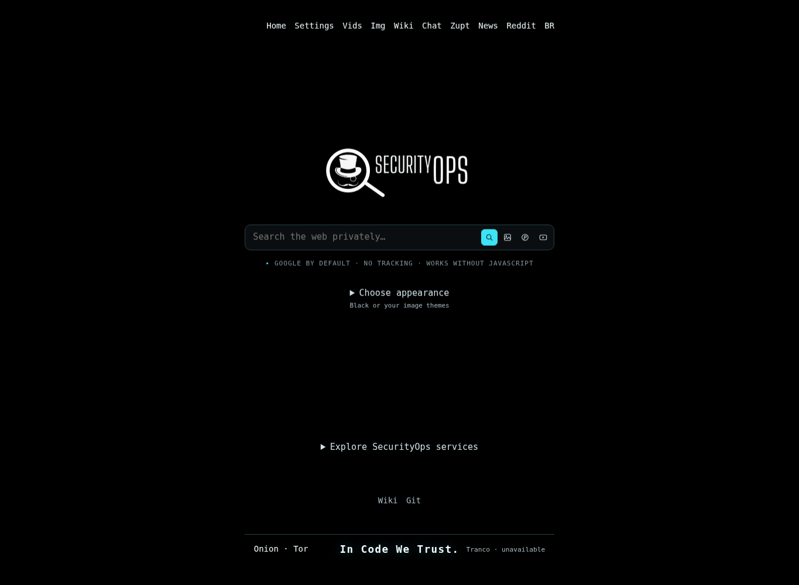

# Security Search v0.9.24

[English](README.md) · [Português do Brasil](README.pt-BR.md)



Renderização local anterior; não é uma captura atual da VPS. Aparência mantida;
esta versão usa recursos **28**. Proxy de pesquisa PHP baseado no
[4get](https://git.lolcat.ca/lolcat/4get), mantido para [SecurityOps](https://securityops.co).
Buscas normais e temas prontos funcionam sem JavaScript. Imagens locais e melhorias
opcionais na busca de imagens usam scripts locais. Provedores externos podem falhar.

## Notícias independentes do Redlib

O novo padrão **News RSS** consulta Google News RSS e, se falhar, Bing News RSS.
São manchetes de publicadores, **não conteúdo do Reddit**. Reddit continua opcional
e pode permanecer indisponível. A edição pode ser inglês/EUA ou português/Brasil.
Selecionar uma única fonte desativa o fallback. Preferências já salvas continuam
respeitadas: selecione News RSS ou abra `/news?scraper=newswire` para trocar.

O diagnóstico recebido mostrou duas respostas HTTP 200 sem resultados Redlib e com
indicadores de desafio, além de HTTP 418 do Nadeko. Aumentar timeouts ou ignorar o
parser não transforma essas páginas em notícias. Não há resolução de CAPTCHA,
troca de identidade nem rotação de proxies para contornar recusas.

O novo critério de deploy exige manchetes e resultados de busca neutra reais e não
vazios da mesma fonte RSS, dentro da VPS. O relatório detalhado fica em
`news-live.json`; fonte e edição são persistidas e conferidas após a troca. Se
ambas falharem, o contêiner atual não é substituído. Os endpoints RSS externos são
best-effort, não uma API garantida. Testes locais não comprovam disponibilidade.

## Desempenho e segurança

Apenas manchetes públicas sem consulta podem entrar no cache: 120 segundos frescas
e até 600 segundos para fallback antigo, claramente identificado e datado. Busca
por palavra não entra no cache. Fonte/edição têm chaves distintas e trava curta
contra atualizações concorrentes. Recusas/desafios suspendem a fonte por dez
minutos; rate limits aguardam pelo menos cinco minutos, respeitando Retry-After
limitado. Não há retry em segundo plano nem fallback para uma busca vazia válida.

Rotas HTTPS fixas, IP público validado, conexão fixada ao IP, verificação TLS,
recusa de redirecionamentos e limite de 1 MiB. São no máximo duas tentativas
sequenciais, com 4,5 segundos por tentativa e nove segundos no adaptador. A primeira
resolução DNS síncrona pode ultrapassar o timeout do cURL: não há promessa de
latência absoluta nem ganho medido em todos os provedores.

XML recusa DTDs, entidades externas, XInclude, links inseguros e estruturas enormes.
São no máximo quarenta títulos com publicador/data/link. Descrições HTML, artigos
completos e imagens remotas não são carregados. Não há paginação RSS inventada.
Páginas de busca permanecem privadas/no-store/noindex e falhas não viram sucesso.

## Recursos preservados

Web, imagens, vídeos, música e Reddit opcional permanecem separados. Google/Brave,
Binternet moderno/legado, seis layouts, qualidade/formato, paginação normal, rolagem
infinita e animações visíveis com limites continuam. Preto puro, seletor de temas,
pré-visualizações e controles pretos na cor do tema são mantidos.

**My picture** abre o seletor local fora dos formulários. JPEG, PNG, WebP e GIF são
identificados pelos bytes; GIF vira imagem estática. Limites: 16 MiB/48 megapixels
após decodificação, saída normalizada de até 1920 pixels/2 MiB. Arquivo, nome e EXIF
não são enviados ao servidor. Padrão: sessão da aba; Remember on this device salva
somente com opção explícita. Remove my picture limpa os dois armazenamentos quando
o navegador permite. Armazenamento bloqueado ou cheio permite uso só na página.

Lain/SecOps históricos e derivados privados continuam fora do Git e das releases,
inclusive Codeberg. Reutilize o pacote externo somente no deploy. Sem ele, Lain
mantém a paleta e SecOps a alternativa Matrix. Tron conserva sua animação otimizada.
Onion/Tranco são preservados, sem inventar ranking quando não houver metadados.

## Aplicar e implantar

Na pasta completa extraída `securitysearch-update-0.9.24`, no computador local:

```fish
fish ./apply-securitysearch.fish ~/securitysearch
and fish ./deploy-securitysearch.fish ~/securitysearch \
    --theme-assets ~/.local/share/securitysearch/operator-themes-v1 \
    --rank-refresh
```

Aceita a árvore exata e limpa v0.9.23-r1 ou v0.9.23; cria commit normal e recusa
alterações conflitantes. SSH `root@securityops.co`, porta **5119**. Preserva bind
`172.17.0.1:5140 → 80`, redes e configurações privadas compatíveis. Não recria NPM.
A suíte offline, prontidão do candidato e verificações reais RSS/Binternet continuam
obrigatórias. Preserve backups/rollback: eles podem conter snapshots montados.
Não use launchers antigos com o manifesto novo e não pule os testes.

## Tag e release

```fish
fish ./publish-securitysearch.fish ~/securitysearch
# Retomar apenas este host, incluindo tarball e checksum:
fish ./publish-securitysearch.fish ~/securitysearch --host git.securityops.co
```

Tag anotada **v0.9.24**. Arquivos `securitysearch-v0.9.24.tar.gz` e seu `.sha256`,
gerados do commit real, não de fixtures. Tokens privados, pushes sem force,
rascunhos verificados e anexos multipart no Forgejo. Tags/notas/anexos conflitantes
são preservados. Somente o arquivo privado `-deploy.tar.gz` recebe temas privados.
Publicação não faz deploy. Releases ficam disponíveis após a publicação em cada
host: [Codeberg](https://codeberg.org/berkeley/securitysearch/releases/tag/v0.9.24),
[GitHub](https://github.com/cristiancmoises/securitysearch/releases/tag/v0.9.24),
[.co](https://git.securityops.co/cristiancmoises/securitysearch/releases/tag/v0.9.24),
[.com.br](https://git.securityops.com.br/cristiancmoises/securitysearch/releases/tag/v0.9.24).

## Auditoria

```sh
sh scripts/test.sh --keep-going
```

Todos os **55** comandos são obrigatórios. A suíte completa precisa das extensões
PHP curl/DOM/XML/mbstring/APCu/Imagick, Python, Node, Git e fish. Dependência ausente
não equivale a teste aprovado. [Auditoria](docs/AUDIT-0.9.24.md) registra limitações;
[notas bilíngues](docs/RELEASE-0.9.24.md) detalham a mudança.
Licença [AGPL-3.0](license.txt). **In Code We Trust.**
