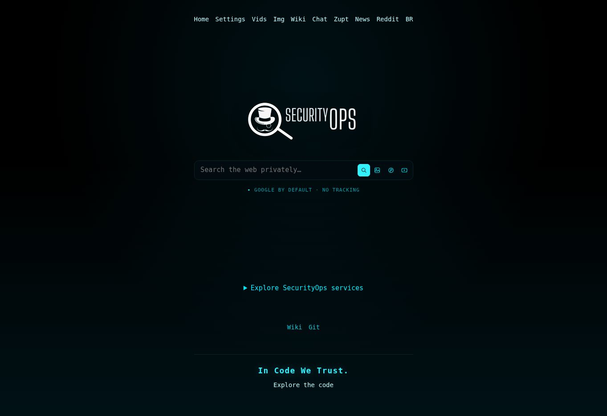

# Security Search v0.9.19

[English](README.md) · [Português do Brasil](README.pt-BR.md)



Página inicial capturada em 2026-09-09 em securityops.co (Tron, 1363 × 936). A instância servia o asset 22; a v0.9.19 mantém esta interface e usa o asset 23. Captura real do navegador.

Buscador proxy PHP baseado no [4get](https://git.lolcat.ca/lolcat/4get). Os quatro ícones SVG de 14 px ficam **dentro da extremidade direita da barra de busca**, em uma linha: Search, Search Image, Search Pinterest e Search YouTube. Os alvos são maiores em telas de toque; rótulos aparecem com mouse ou foco. Tron continua padrão, com respeito aos temas salvos. Wiki/Git no rodapé ficam sem caixa, junto da mensagem central **In Code We Trust.**

**Google continua padrão.** Se a primeira busca web/imagens falhar, há uma tentativa automática no Brave, com aviso visível e filtros compatíveis. Google recebe até 12 segundos de rede e Brave até 8, dentro do prazo compartilhado de 20 segundos. Não há troca no meio da paginação nem mudança da API. Se ambos falharem, a resposta continua sendo 503 com recuperação; não existe garantia de disponibilidade externa.

**GIF, WebP animado e APNG** reproduzem quando visíveis: no máximo dois carregando e quatro ativos. Fora da tela ou com a aba oculta, voltam a uma imagem estática. Settings permite desativar; redução de movimento e Save-Data são respeitados. Formatos estáticos não viram animações. São mantidos seis layouts, qualidade alta até 1280 px, filtros e rolagem infinita, sem Automatic pages ou temporizador.

O novo link **Reddit** abre `libre.securityops.co`. A rota local `/news` mostra posts recentes de r/news + r/worldnews; com palavras-chave, busca posts relacionados pelo Redlib. News na navegação superior continua em `news.securityops.co`. Pinterest usa `images.securityops.co` e YouTube usa `invidious.securityops.co`.

Somente a busca de imagens usa dois scripts locais pequenos, para rolagem e controle de animação. As outras páginas continuam sem JavaScript. Cada recurso tem uma preferência independente; Next page e links nativos continuam disponíveis sem scripts. Brave não oferece continuação de imagens e seu filtro de formato é aplicado à página recebida, podendo deixar zero resultados.

O Redlib retornou HTTP 503 na verificação de 2026-09-09. Os testes locais de parser e integração passaram; notícias ao vivo dependem da recuperação dessa instância.

O kit de publicação `v0.9.19` contém bundle Git com o histórico necessário, fonte completo, checksums e um launcher fish. Ele atualiza o checkout limpo de `main` por fast-forward, envia branch/tag aos quatro repositórios e cria ou retoma releases. Digite o token correspondente a cada host. Se `data/config.php` ainda indicar `VERSION = 17`, o checkout permanece antigo; o kit aplica a versão nova antes do envio.

Dentro do kit extraído:

```fish
fish ./publish-securitysearch-v0.9.19.fish ~/securitysearch
```

[Publicação em pt-BR](docs/PUBLISHING.pt-BR.md) · [Notas da versão](docs/RELEASE-0.9.19.md)

[Operação e deploy IONOS](docs/OPERATIONS-0.9.19.pt-BR.md) · [Auditoria](docs/AUDIT-0.9.19.md) · [Interface](docs/UI.md)

Coloque o arquivo completo, o SHA-256 e `deploy-securitysearch-v0.9.19.fish` em `~/Downloads`. Execute o script fish para copiar por SSH **5119** a **root@securityops.co**. O atualizador preserva **172.17.0.1:5140 → 80**, testa um candidato e mantém rollback. A captura da página inicial foi verificada em navegador; build Docker e deploy real não foram executados neste ambiente.

`sh scripts/test.sh` requer PHP com curl/DOM/mbstring/APCu/sodium/fileinfo/Imagick, Python 3 e Node.js (somente testes). A suíte usa provedores simulados e mídia neutra em localhost, sem buscas externas. Histórico: [README anterior](docs/HISTORY-README-0.9.14.pt-BR.md). Licença [AGPL-3.0](license.txt).
