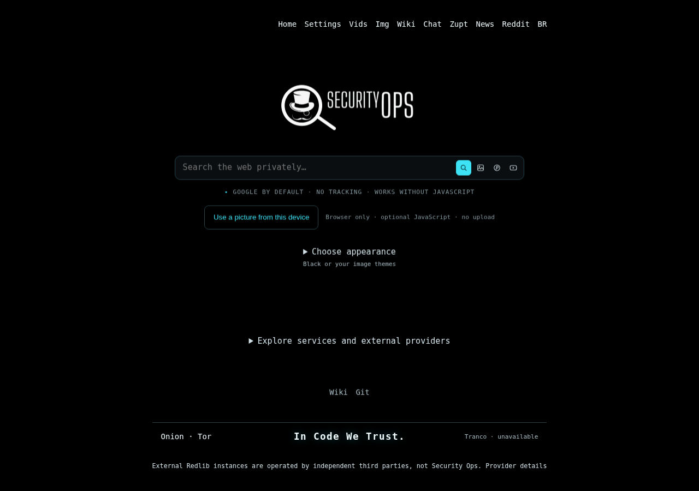

# SecuritySearch v0.9.30

[English](README.md) · [Português do Brasil](README.pt-BR.md)



Renderização local no Chromium da homepage Black gerada pelo PHP da v0.9.30, com recursos
locais incorporados. É evidência visual da versão, não uma captura da VPS, Lighthouse ou
benchmark competitivo. [Captura móvel](docs/screenshots/securitysearch-0.9.30-mobile.png).

SecuritySearch é um proxy de pesquisa em PHP baseado no
[4get](https://git.lolcat.ca/lolcat/4get), mantido pela Security Ops. Pesquisas normais e
temas embutidos funcionam sem JavaScript; fotos locais e melhorias de imagens usam scripts
same-origin opcionais. Provedores externos podem recusar ou limitar requisições.

## v0.9.30: entrega concorrente sem remover funções de busca

Esta versão foca concorrência do servidor e trabalho decorativo das páginas de resultado.
Google/CSE, Brave, Binternet, notícias RSS, layouts, paginação, My Picture, temas, controles
de privacidade, gates de deploy e rollback são preservados.

### Apache event MPM + PHP-FPM

A imagem anterior usava Apache prefork/mod_php com `MaxRequestWorkers` de 16. A v0.9.30
usa **Apache event MPM + PHP-FPM** como runtime verificado do candidato. O pool PHP mantém
`pm.max_children = 16`; portanto, o teto anterior de concorrência PHP não é aumentado. Em
vez disso, o Apache pode atender arquivos estáticos e conexões keep-alive separadamente dos
processos PHP.

A documentação Apache do 4get upstream também recomenda event MPM com PHP-FPM. O
SecuritySearch não copia o pool muito maior usado pela instância pública 4get.ca, porque a
capacidade segura depende de memória e tráfego desta VPS. O runtime prefork/mod_php antigo
continua como fallback explícito do operador, mas o deploy normal fixa FPM e rejeita o
candidato se os testes de prontidão FPM/event falharem.

O healthcheck verifica `/` e a rota PHP `/settings`, evitando que a homepage estática esconda
um pool PHP-FPM parado.

### Favicons não podem monopolizar workers de pesquisa

Favicons dos resultados são decorativos. Um miss frio tinha orçamento remoto de oito
segundos e podia competir com pesquisas úteis. A v0.9.30 mantém descoberta e fallback, mas
limita o trabalho remoto total a 2,5 segundos e, com APCu disponível, a no máximo quatro
atualizações remotas simultâneas.

Trabalho duplicado do mesmo host é suprimido temporariamente. Falhas recentes recebem cache
negativo curto; ícones armazenados recebem cache de navegador por um dia e o placeholder 404
por cinco minutos. Chaves APCu contêm hashes dos hosts, não consultas, corpos de resultados,
cookies ou credenciais. Falha de favicon nunca transforma um resultado de busca em falha da
pesquisa.

## Desempenho e limites do benchmark

O arquivo `tools/secops-web-benchmark-v3.fish` permanece **manual e byte a byte inalterado**.
Ele não é executado durante instalação, deploy, auditoria ou empacotamento. Esta versão não
publica vencedor ou resultado competitivo.

No GNU Guix:

```fish
fish --no-config "$HOME/securitysearch/tools/secops-web-benchmark-v3.fish"
```

Ou com Python/curl já instalados:

```fish
fish --no-config "$HOME/securitysearch/tools/secops-web-benchmark-v3.fish" --system-deps
```

O benchmark mede entrega HTTP do HTML da homepage, não LCP do navegador, latência dos
provedores ou qualidade dos resultados. Um novo teste na mesma máquina/rede é necessário
antes de afirmar que o SecuritySearch superou o 4get.ca.

## Busca, imagens e privacidade preservadas

Google web/imagens mantém bootstrap sem consulta, validação de registros, correções de
concorrência da sessão, offsets explícitos e fallback Brave limitado à primeira página.
Binternet mantém parser antigo/novo, seis layouts, paginação normal, scroll infinito opcional
e animações limitadas. Notícias RSS continuam padrão.

Instâncias Redlib externas são operadas por terceiros independentes, **não pela Security Ops**. A Security Ops mantém apenas a integração. **My Picture** continua processando a foto
no navegador sem enviar imagem, nome de arquivo ou EXIF. O pacote histórico Lain/SecOps
continua fora do Git e de todos os releases públicos, inclusive Codeberg.

## Aplicar, auditar e implantar

Para atualizar diretamente a partir da linha v0.9.27 atualmente publicada, use o
lançador final tudo-em-um da v0.9.30 fornecido no kit:

```fish
fish "$HOME/Downloads/securitysearch-v0.9.30-all-in-one.fish"
```

Ele aceita o baseline publicado v0.9.27 exato e limpo ou a árvore v0.9.30 pré-correção
já aplicada, corrige a auditoria nativa do static-home, implanta o candidato, exige a
auditoria nativa completa e os gates de provedores, remove somente containers/imagens
SecuritySearch antigos após o cutover bem-sucedido e publica o mesmo commit/tag/archive
final nos quatro forges. Nunca usa force-push nem move uma tag existente.

A implantação usa `root@securityops.co`, porta SSH 5119, e preserva as redes/binding Docker e o upstream do Nginx Proxy Manager. A auditoria nativa isolada completa, readiness, runtime FPM/event, RSS, Binternet e as verificações Google web/imagens solicitadas precisam passar antes do cutover.

## Publicar v0.9.30

```fish
fish ./publish-securitysearch.fish "$HOME/securitysearch"
# Repetir somente um host, incluindo os anexos:
fish ./publish-securitysearch.fish "$HOME/securitysearch" --host git.securityops.com.br
```

A publicação cria/reutiliza a tag anotada `v0.9.30` e envia
`securitysearch-v0.9.30.tar.gz` e `.tar.gz.sha256`. Tags, notas ou anexos conflitantes são
preservados, não substituídos à força. Assets privados do operador nunca entram no pacote
público.

## Validação

```sh
sh scripts/test.sh --keep-going
```

Todas as suítes anteriores continuam obrigatórias. A v0.9.30 adiciona cobertura de admissão
de favicons, política HTTP de favicons, contratos FPM/event, configuração FPM nativa e
publicação/empacotamento da versão. O teste FPM nativo deve rodar na imagem Alpine de
auditoria; ausência local de `php-fpm84` não é aprovação. Consulte as
[notas](docs/RELEASE-0.9.30.md), [notas de desempenho](docs/PERFORMANCE-0.9.30.md) e
[auditoria](docs/AUDIT-0.9.30.md).

Licença: [AGPL-3.0](license.txt). **In Code We Trust.**
