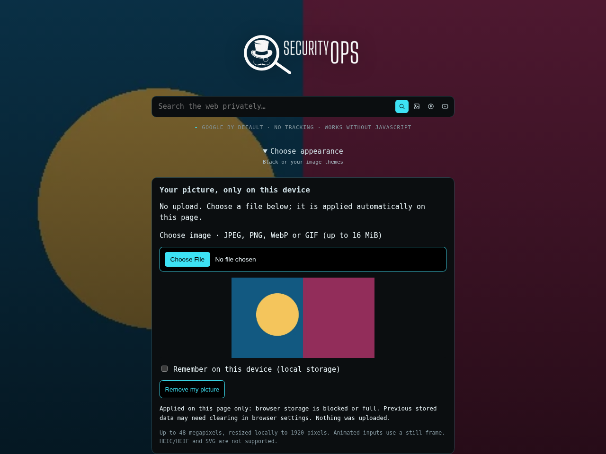

# Security Search v0.9.23

**Correção de auditoria r1:** ajusta expectativas antigas do link Redlib e do terceiro fallback e mostra trechos dos testes que falharam no deploy. Aplicação 0.9.23 / asset 27 permanecem. [Correção e limites da validação](docs/AUDITFIX-0.9.23-r1.md).

[English](README.md) · [Português do Brasil](README.pt-BR.md)

Buscador proxy PHP para [SecurityOps](https://securityops.co/), baseado no
[4get](https://git.lolcat.ca/lolcat/4get). Aplicação **0.9.23**, assets **27**.
Provedores externos podem falhar; não se promete disponibilidade universal ou
ganho de velocidade medido em todos eles.

## Notícias

libre.securityops.co deixa de ser o padrão ativo. O primeiro candidato compilado
é **redlib.privacyredirect.com**, com **redlib.nadeko.net** e
**redlib.privadency.com** como alternativas sequenciais fixas. A lista oficial
foi consultada, mas não comprova funcionamento.

Antes da troca, o deploy exige itens reais reconhecidos no feed E em uma busca
neutra por palavra-chave na mesma instância pela rede da VPS. A origem aprovada
fica em FOURGET_REDLIB_PRIMARY no novo contêiner. Falha mantém a produção e grava
redlib-live.json no backup. Isso não foi verificado ao vivo no ambiente de autoria.

As buscas não são disparadas em paralelo para todas as origens. Paginação conserva
a instância que respondeu; tokens de uma origem retirada devem ser reiniciados.
Avisos e link direto seguem a configuração. A instância externa recebe consulta e
IP do servidor, não os cookies do visitante. Somente o feed público inicial sem
consulta pode ser armazenado temporariamente. FOURGET_REDLIB_FALLBACKS=false
mantém apenas a origem escolhida nas requisições dos visitantes.

## Minha imagem



**Fixture local de navegador, não captura da VPS.** O HTML PHP real e recursos
foram embutidos; a imagem é um padrão de teste. Seleção, FileReader, decodificação,
canvas e exibição CSS foram exercitados. A navegação direta foi bloqueada pela
política do ambiente e não é apresentada como aprovada.

Clique **Use a picture from this device** e depois **Choose File**. O editor abre
antes dos temas e aplica a imagem sem outro clique de salvar. Configurações também
exibem o editor para My picture. O CSP agora é recalculado após a preferência no
POST, corrigindo a resposta que emitia o script com script-src 'none'.

JPEG, PNG, WebP e GIF são identificados pelos bytes mesmo com MIME vazio; animações
viram um quadro. Limites: 16 MiB de entrada, 48 megapixels após decodificar, saída
até 1920 px e URL normalizada de 2 MiB. HEIC/HEIF e SVG não são suportados. O navegador
pode alocar memória ao decodificar antes da checagem de dimensões.

O input não tem nome e fica fora dos formulários; não há API de upload, fetch,
beacon, WebSocket ou escrita de cookies nesse script. A imagem é reprocessada
localmente; nome e EXIF não são enviados. A sessão da aba é padrão (a restauração
do navegador pode recuperá-la). **Remember on this device** habilita persistência
local explicitamente; **Remove my picture** limpa ambas as opções quando permitido.
Armazenamento cheio/bloqueado permite exibição só na página e mostra aviso. Isso
não é armazenamento criptografado: usuários do dispositivo e scripts da mesma
origem podem acessar os dados. Falhas de remoção são informadas.

Sem JavaScript, o seletor desabilitado explica o motivo. **Works without JavaScript**
se refere às buscas comuns e temas incluídos, não a essa função opcional ou aos
aprimoramentos de imagens. A página Black continua sem script executável; Custom
mantém connect-src 'none' na página inicial.

## Funcionalidades e proteções mantidas

Google/Brave, parser Binternet moderno/legado, seis layouts, prévias menores reais,
paginação, rolagem opcional e GIF/WebP/APNG com limites e pausa permanecem. Temas,
seleções pretas com cor do tema, link onion, Tranco em cache e noindex de consultas
privadas são mantidos. Tron histórico continua incluído. Lain/SecOps privados e
derivados permanecem no pacote externo de operador, fora dos commits e anexos novos
dos quatro hosts, inclusive Codeberg. Sem --theme-assets, usam-se paleta/Matrix.
O histórico antigo não é reescrito. Todas as correções r1/r2 permanecem.

## Atualizar e publicar

Use **securitysearch-update-0.9.23-r1** em um checkout main limpo com a v0.9.23 já aplicada. Alterações desconhecidas, tags e arquivos conflitantes são
preservados. [Instruções r1](docs/AUDITFIX-0.9.23-r1.md); o guia de operações anterior descreve o upgrade original, não este reparo.

```fish
fish ~/Downloads/securitysearch-update-0.9.23-r1/apply-securitysearch.fish ~/securitysearch
and fish ~/Downloads/securitysearch-update-0.9.23-r1/deploy-securitysearch.fish \
    ~/securitysearch --theme-assets ~/.local/share/securitysearch/operator-themes-v1 --rank-refresh
```

Mantém root@securityops.co, SSH 5119, redes e 172.17.0.1:5140 -> 80; não reconfigura
NPM. Auditoria offline completa, prontidão, feed+busca Redlib reais e Binternet real
precisam passar antes da troca. Preserve backups e comandos de rollback.

Depois do deploy aprovado:

```fish
fish ~/Downloads/securitysearch-update-0.9.23-r1/publish-securitysearch.fish ~/securitysearch
```

Retomada de somente um host, incluindo release e anexos:

```fish
fish ~/Downloads/securitysearch-update-0.9.23-r1/publish-securitysearch.fish \
    ~/securitysearch --host git.securityops.co
```

Cada release concluída contém securitysearch-v0.9.23.tar.gz e .tar.gz.sha256 do
commit real anotado, não binários ou imagem Docker. Saída local:
~/securitysearch-release-v0.9.23/. O bundle incremental depende da v0.9.20. Tokens
são solicitados privadamente; arquivos/tags conflitantes não são substituídos.
Checksum não é assinatura e tag anotada não é automaticamente assinada. Publicação
não faz deploy e não é uma transação global entre servidores.

[Codeberg](https://codeberg.org/berkeley/securitysearch/releases/tag/v0.9.23) ·
[GitHub](https://github.com/cristiancmoises/securitysearch/releases/tag/v0.9.23) ·
[SecurityOps .co](https://git.securityops.co/cristiancmoises/securitysearch/releases/tag/v0.9.23) ·
[SecurityOps .com.br](https://git.securityops.com.br/cristiancmoises/securitysearch/releases/tag/v0.9.23)

Os links só funcionam após a publicação em cada host.

## Validação

```sh
sh scripts/test.sh --keep-going
```

Os **48** comandos continuam obrigatórios; qualquer erro impede o deploy.
PHP curl/DOM/mbstring/APCu/Imagick/sodium, Python, Node, Git e fish são necessários.
[Auditoria](docs/AUDIT-0.9.23.md) separa testes PHP HTTP reais, fixtures do navegador,
mocks de Docker/API e dependências ausentes. Nenhum deploy, push ou sucesso de
provedor externo foi declarado durante a preparação do kit.

[Notas da versão](docs/RELEASE-0.9.23.md) · [Licença AGPL-3.0](license.txt).
**In Code We Trust.**
