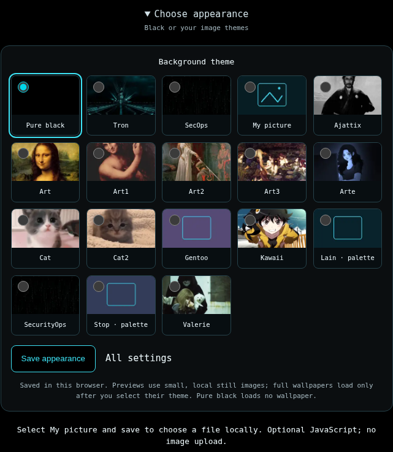

# Security Search v0.9.21

[English](README.md) · [Português do Brasil](README.pt-BR.md)


**Renderização local, não captura da VPS em produção.** O controlador PHP real
gerou o HTML; Chromium renderizou com recursos locais incorporados e scripts
desativados. Versão dos recursos: **25**.

Buscador proxy PHP baseado no [4get](https://git.lolcat.ca/lolcat/4get), mantido para
[SecurityOps](https://securityops.co/). Os provedores externos podem recusar,
limitar ou alterar respostas. Não há garantia de disponibilidade ou ganho de
velocidade em todos os provedores.

## Busca, notícias e imagens

Google continua com a tentativa limitada e identificada pelo Brave na primeira
busca web/imagens. A paginação não troca silenciosamente de provedor. Falhas
inequívocas de transporte cURL recebem uma pausa curta de oito segundos para a
primeira página; erros de parser e resultados vazios não são classificados como
falhas de rede. Limites existentes de conexão/requisição são preservados.

Reddit tenta **libre.securityops.co → redlib.nadeko.net →
redlib.privacyredirect.com**, em sequência, no máximo três vezes, com até 3,5
segundos por instância e dez segundos no total. Instâncias que falham aguardam
vinte segundos. A origem que respondeu aparece na interface e é mantida nos
links de continuação autenticados. Somente o feed público inicial, sem consulta,
pode ser armazenado por sessenta segundos; pesquisas com palavras-chave não.

**Privacidade:** em uma falha da instância principal, outro operador Redlib pode
receber a consulta e o IP do servidor. Cookies do visitante não são encaminhados.
O formulário e a resposta informam esse comportamento. Configure
`FOURGET_REDLIB_FALLBACKS=false` para usar apenas a instância principal. A lista
oficial de instâncias não comprova conectividade a partir da VPS.

A compatibilidade antiga/nova do Binternet, paginação limitada e uso da prévia
menor realmente retornada são mantidos. Continuam os seis layouts, qualidade,
filtros, paginação manual e rolagem infinita opcional. GIF/WebP animado/APNG
mantêm o poster durante o carregamento da camada animada, com **dois carregando
e quatro ativos**, botão Play/Pause, suspensão fora da tela/aba oculta e respeito
a movimento reduzido/economia de dados. Uma falha não dispara repetição automática.

## Temas e imagem pessoal



Preto continua padrão. Dark, Wine e The Birthday Massacre saem dos seletores;
escolhas antigas migram para Black. O gentoo duplicado foi consolidado. Todos os
dezoito temas têm prévias locais pequenas; Lain e Stop são identificados como
paletas. Seleções nativas usam fundo preto e a cor de destaque do tema.

Tron restaura sua animação em WebP otimizado, aproximadamente 527 KB. SecOps usa a
animação Matrix já disponível, aproximadamente 1,37 MB, e cores em ciano; **não é
a arte histórica que havia sido removida**. Alternativas estáticas e o controle
de movimento não dependem de JavaScript. Apenas o tema escolhido carrega wallpaper.

**My picture:** selecione, salve e escolha JPEG/PNG/WebP de até 8 MiB. O controle
não pertence a formulário nem tem nome de campo. Um script opcional local lê,
redimensiona e recodifica no navegador: até 24 megapixels na origem, 1920 pixels
na maior dimensão de saída e data URL de até 2 MiB. Não há endpoint de upload
para imagem, nome do arquivo ou EXIF. O padrão é `sessionStorage` da aba,
sujeito à restauração de sessão do navegador. Remember on this device habilita
`localStorage` explicitamente; Remove limpa ambos. Isso não é um cofre criptografado:
um navegador compartilhado ou script da mesma origem pode acessar seu armazenamento.

A frase correta é **Works without JavaScript**. Busca normal e temas nativos
funcionam sem ele; rolagem/animações de imagens e a foto pessoal usam scripts
opcionais locais. A página inicial Black não emite script. No modo Custom, o
script é permitido mas conexões de rede continuam proibidas pelo CSP da inicial.

## Rodapé, Tranco e metadados

O rodapé mantém o endereço onion v3 existente e mostra Tranco discreto à direita,
com a data da lista. A renderização nunca consulta Tranco. Uma tarefa CLI/systemd
separada atualiza os metadados públicos diariamente. **Não é incluído um ranking
inventado:** antes de uma atualização válida aparece unavailable. Cache com mais
de três dias expira; resposta vazia é distinguida. Ranking não é avaliação de
segurança/qualidade. O endereço onion tem formato/checksum válidos; sua
acessibilidade não foi verificada.

Metadados canônicos/sociais, Website microdata, cartão 1200×630 e link do sitemap
foram ajustados. Configurações e buscas privadas continuam noindex. Não se promete
popularidade, posição no Google ou avaliações falsas.

## Atualizar, implantar e publicar

Use o kit correspondente **securitysearch-update-0.9.21**, não os lançadores
antigos com hashes diferentes:

```fish
fish ~/Downloads/securitysearch-update-0.9.21/apply-securitysearch.fish ~/securitysearch
fish ~/Downloads/securitysearch-update-0.9.21/deploy-securitysearch.fish ~/securitysearch --rank-refresh
fish ~/Downloads/securitysearch-update-0.9.21/publish-securitysearch.fish ~/securitysearch
```

São operações separadas. Aplicar requer a árvore main publicada da v0.9.20 limpa
e cria um commit local normal. O deploy preserva SSH **5119**, **root@securityops.co**,
redes e **172.17.0.1:5140 → 80**; não recria Nginx Proxy Manager. Antes da troca,
a suíte offline completa, prontidão e teste real Binternet devem passar. Guarde
backups e rollback. O timer Tranco opcional é instalado somente após deploy bem-sucedido.
Falha de metadados não provoca rollback da aplicação.

Publicar cria/reutiliza a tag anotada **v0.9.21**, gera o pacote do commit real e
verifica hosts selecionados antes da primeira escrita. Rascunhos/arquivos iguais
são retomados; tags/notas/arquivos conflitantes nunca são sobrescritos. Tokens são
solicitados de forma privada, sem aparecer em argumentos, URLs ou arquivos.
Para retomar somente o host .co, **incluindo os anexos da release**:

```fish
fish ~/Downloads/securitysearch-update-0.9.21/publish-securitysearch.fish ~/securitysearch --host git.securityops.co
```

Cada release concluída contém `securitysearch-v0.9.21.tar.gz` e
`securitysearch-v0.9.21.tar.gz.sha256`: código-fonte PHP completo da tag, não
binários ou imagem Docker. O bundle incremental local depende da v0.9.20.
Publicação não faz deploy e os quatro servidores não formam uma transação atômica.

[Codeberg](https://codeberg.org/berkeley/securitysearch/releases/tag/v0.9.21) ·
[GitHub](https://github.com/cristiancmoises/securitysearch/releases/tag/v0.9.21) ·
[SecurityOps .co](https://git.securityops.co/cristiancmoises/securitysearch/releases/tag/v0.9.21) ·
[SecurityOps .com.br](https://git.securityops.com.br/cristiancmoises/securitysearch/releases/tag/v0.9.21)

Os links só funcionam após publicação naquele host. SHA-256 verifica integridade,
não assinatura do autor. Tag anotada não é automaticamente assinada.

## Validação

```sh
sh scripts/test.sh
```

A suíte completa precisa de extensões PHP, Python, Node, Git e fish. O ambiente de
autoria não executou a suíte nativa completa; consulte o [relatório](docs/AUDIT-0.9.21.md).
Testes com fixtures não comprovam provedores reais, upload autenticado ou deploy.
A navegação do Chromium foi bloqueada pela política do ambiente; as imagens acima
são renderizações locais isoladas, não aprovação do teste de navegação/storage.
O teste opcional real está em `tests/browser-experience.py`.

[Notas bilíngues](docs/RELEASE-0.9.21.md) · [Operação/publicação](docs/OPERATIONS-0.9.21.pt-BR.md)

Licença [AGPL-3.0](license.txt). Mantidos API, Invidious, ações de busca, serviços
e **In Code We Trust.**.
