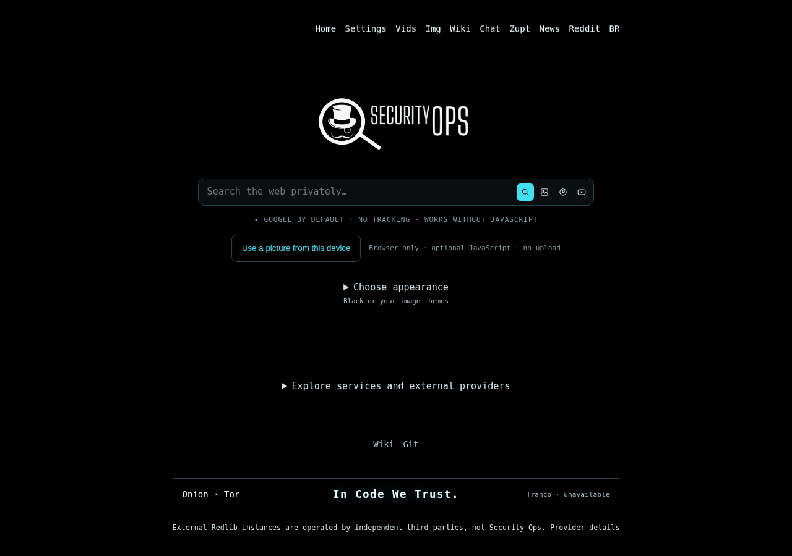

# SecuritySearch v0.9.26

[English](README.md) · [Português do Brasil](README.pt-BR.md)



Captura local do Chromium a partir do HTML gerado pelo PHP desta versão. Os recursos
locais foram incorporados na fixture porque o navegador de autoria bloqueia navegação
para localhost. Não é uma captura nova da VPS, um teste Lighthouse nem um resultado
de desempenho. [Captura móvel](docs/screenshots/securitysearch-0.9.26-mobile.png).

Buscador proxy PHP baseado no [4get](https://git.lolcat.ca/lolcat/4get), mantido pela
Security Ops. **Funciona sem JavaScript** nas buscas normais e nos temas fornecidos.
Imagens locais e melhorias da galeria usam scripts opcionais da própria origem.
Provedores externos podem falhar, limitar ou recusar consultas.

## Correções de Google web e imagens

A integração CSE valida JSONP com prefixos inertes limitados, registros individuais
e deslocamentos numéricos de paginação enviados pelo provedor. Altura zero/inválida
em miniaturas deixa de causar divisão por zero; campos opcionais malformados não
interrompem os demais resultados válidos. Uma página inteira inválida continua sendo
um erro, não resultados vazios artificiais. Prévia pequena, grande e original mantêm
URLs realmente fornecidas; parâmetros de links não são removidos especulativamente.

A inicialização tenta primeiro o carregador `cse.js` documentado pelo Google, sem
consulta do usuário. O formato suportado elimina uma requisição de preparação.
Somente falha de formato pode usar uma descoberta legada limitada. Bloqueios,
captchas e limites não provocam essa recuperação. Nenhum JavaScript remoto é executado.

O cache da sessão é revisto depois da aquisição do bloqueio: um processo não descarta
uma sessão nova criada por outro. A espera compara o token rejeitado, não apenas um
identificador interno. O cache contém metadados, nunca consultas, resultados ou
cookies dos visitantes. São mantidos prazos, verificação TLS, limites de resposta,
paginação vinculada ao provedor e a tentativa inicial Google → Brave já existente.
Essas correções offline não provam a causa de cada falha real nem garantem toda busca.

## Página inicial

As substituições do template passam a ocorrer uma única vez; os valores inseridos
não são interpretados novamente como instruções do template. Somente templates
locais sem conteúdo de usuários são memorizados. O CSS visual é compilado de uma
fonte legível, removendo comentários/espaços excedentes sem compilação no servidor
nem carregador JavaScript. Permanecem CSS crítico inline e banner WebP otimizado.

`Server-Timing: app;dur=...` informa somente processamento PHP, não DNS, TLS, filas do
proxy ou renderização. HTML personalizado continua privado/no-store. Não há nova
pré-conexão externa, analytics ou cache compartilhado de buscas.

## Script manual de benchmark — sem resultados publicados

O [SecOps Web Benchmark 3.0.0 fornecido](tools/secops-web-benchmark-v3.fish) está
incluído sem alterações. **Não foi executado nesta atualização e não participa da
auditoria, instalação ou deploy.** Não incluímos tabelas, resultados, vencedor ou
alegações de superioridade. Os resultados poderão ser adicionados posteriormente.

Para executar depois, no GNU Guix:

```fish
fish --no-config "$HOME/securitysearch/tools/secops-web-benchmark-v3.fish"
```

Com Python e curl já instalados:

```fish
fish --no-config "$HOME/securitysearch/tools/secops-web-benchmark-v3.fish" --system-deps
```

São 21 rodadas medidas, uma rodada inicial excluída e pausa de um segundo por padrão.
A saída fica em `~/Downloads/securityops-benchmarks/`. O modo Guix usa um ambiente
temporário de dependências. Mede somente entrega de HTML da página inicial por HTTP,
não LCP, imagens/CSS, consultas Google ou qualidade de resultados. Rede, localização,
DNS/TLS, caches e horário influenciam. Não afirmamos ser mais rápidos que o 4get.ca.

## Privacidade, atribuição e recursos preservados

News RSS continua padrão. **Instâncias externas do Redlib são operadas por terceiros
independentes, não pela Security Ops.** A Security Ops mantém a integração, não essas
instâncias, sua disponibilidade ou suas políticas. Os avisos da interface e do About
são preservados. Busca Binternet, animações, layouts, paginação, onion e Tranco continuam.

My picture processa a imagem somente no navegador, fora de formulários; persistência
é opcional e a remoção continua disponível. Os controladores de imagem local/animação
e a implementação RSS não foram alterados. Lain/SecOps privados ficam fora do Git e
de todos os anexos públicos, inclusive Codeberg, sendo usados apenas no deploy privado
com `--theme-assets`. Reutilize o pacote existente fora do repositório.

## Aplicar, validar e implantar

Na pasta do kit `securitysearch-update-0.9.26`, sobre um checkout limpo e exato v0.9.25:

```fish
fish ./apply-securitysearch.fish "$HOME/securitysearch"
and fish ./deploy-securitysearch.fish "$HOME/securitysearch" \
    --theme-assets "$HOME/.local/share/securitysearch/operator-themes-v1" \
    --verify-google \
    --rank-refresh
```

O kit cria um commit normal, preserva alterações conflitantes e não move tags.
Usa `root@securityops.co`, SSH 5119, preservando Docker, redes e o upstream do NPM.
Mantenha o kit completo e todos os backups/caminhos de rollback. Suíte offline,
prontidão, notícias RSS reais e Binternet continuam obrigatórios. A opção explícita
`--verify-google` exige resultados não vazios de Google web **e** imagens no candidato
antes da troca. Brave não conta como Google aprovado. A primeira falha impede a
segunda consulta e mantém a produção; consulte `google-live.json` no backup informado.
Duas consultas neutras não comprovam disponibilidade para todas as pesquisas.

## Publicar a versão

```fish
fish ./publish-securitysearch.fish "$HOME/securitysearch"
fish ./publish-securitysearch.fish "$HOME/securitysearch" --host git.securityops.com.br
```

Cria/reutiliza a nova tag anotada `v0.9.26` e os anexos `securitysearch-v0.9.26.tar.gz`
e `.tar.gz.sha256`. A segunda linha retoma somente o host indicado, com anexos.
Nenhuma tag/versão anterior ou anexo conflitante é substituído. Tokens são privados;
publicar não faz deploy, e o pacote privado de imagens não é incluído.

## Auditoria

```sh
sh scripts/test.sh --keep-going
```

São 67 comandos obrigatórios, sem remover suítes anteriores. O benchmark comparativo
não está no runner. Dependências nativas ausentes contam como falhas; mocks não
comprovam funcionamento de provedores reais. Consulte os registros executados e
limites em [AUDIT](docs/AUDIT-0.9.26.md), as [notas](docs/RELEASE-0.9.26.md) e a
[análise do upstream](docs/UPSTREAM-0.9.26.md). Licença [AGPL-3.0](license.txt).
**In Code We Trust.**
