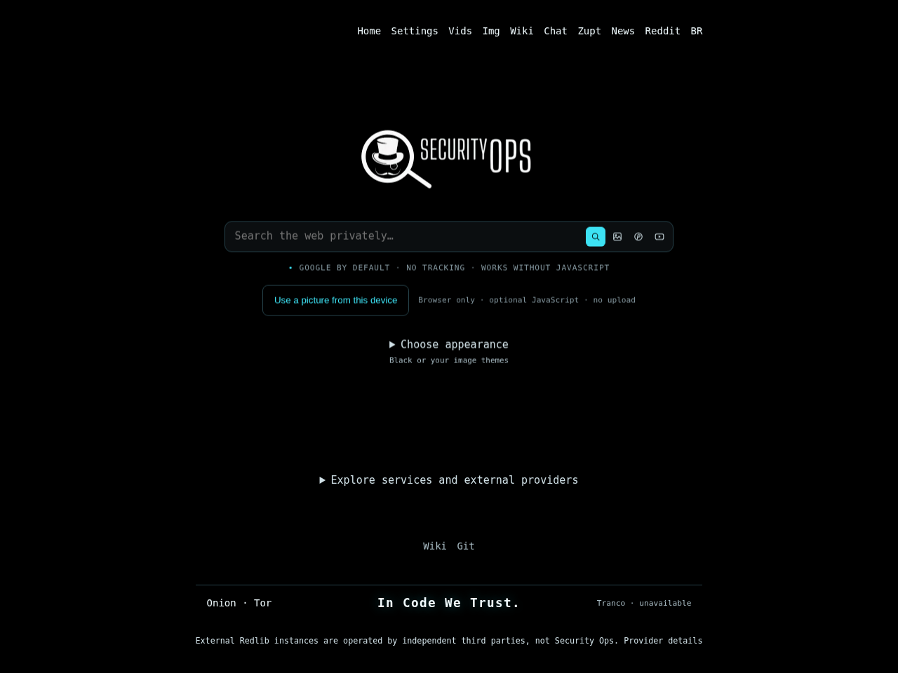

# SecuritySearch v0.9.40

[English](README.md) · [Português do Brasil](README.pt-BR.md) · [Documentação](docs/INDEX.md)



Captura histórica local da v0.9.36 no Chromium, com rede bloqueada. Não é uma captura
atual da produção, uma amostra de resultados reais ou uma medição de desempenho.

SecuritySearch é um proxy de pesquisa em PHP, orientado à privacidade, baseado no
[4get](https://git.lolcat.ca/lolcat/4get) e mantido pela Security Ops.
Pesquisa web, imagens, vídeos, notícias e música usam as integrações existentes.
Pesquisa, filtros, paginação e temas incluídos funcionam sem JavaScript.
My Picture, controles de animação e rolagem infinita usam JavaScript opcional da própria origem.
Bloqueios e indisponibilidade de provedores são tratados como falhas, não como sucesso.

**A atualização vai diretamente da v0.9.30 verificada para a v0.9.40.**
Não é necessário instalar versões intermediárias. A aplicação usa o identificador `0.9.40`;
os assets estáticos usam o identificador independente `40`.
O pacote permite executar o deploy com verificações; não comprova aceitação em produção.

## Alterações desde a v0.9.30

O pacote cumulativo inclui os ajustes mantidos das v0.9.31–v0.9.38: entrega de recursos
estáticos, favicons, validação do proxy de imagens/PNG, seleção de prévias úteis em vez
de placeholders de um pixel, scripts menores com integridade verificada e auditoria completa.
As correções atuais preservam consultas literais `0`, `all` e `any`, filtros com valor zero
e a continuação como um único parâmetro. Os oráculos web usam a consulta normalizada.
Falhas de música preservam HTTP 503, no-store e Retry-After.

A seleção de imagens considera no máximo 32 fontes fornecidas por cartão, sem sondagens
adicionais. Não foram adicionados cache de consultas, anúncios, chamadas especulativas,
dependências JavaScript ou alegações de vitória em benchmarks.
Bufferizar a saída de música preserva os cabeçalhos; não é uma otimização de latência.

Os comandos obrigatórios totalizam 119. Todos precisam ser aprovados. Os 115 comandos anteriores
mantêm a ordem; quatro suítes cobrem consulta, HTTP, contrato da versão e publicação.
Comandos ausentes/duplicados, registros incompletos, saídas não zero e dependências ausentes
impedem a aprovação. Consulte o relatório de validação específico entregue com o pacote.

## Atualização direta na IONOS

Downloads em `~/Downloads`; checkout Git completo e limpo em `~/securitysearch`, branch `main`.
São necessários Fish, Python 3, Git, OpenSSH, coreutils e tar/gzip localmente.
Os scripts não exigem PHP, Docker ou `guix shell` local.

A v0.9.30 observada no GitHub corresponde ao commit
`331cf550d8b279736126e7362fb699f99fc2bc66` e à árvore
`488b01ae481e8e4e95dad3743c2a175c43065c97`.
A VPS e os outros forges não foram consultados para inferir seu estado.
O script verifica a árvore local completa, não apenas o texto da versão.
Aceita nove bases exatas entre v0.9.30 e v0.9.38 e a v0.9.40 exata já aplicada.
Alterações locais e bases desconhecidas não são descartadas nem sobrescritas.

Salve o script de deploy e seu `.sha256` diretamente em `~/Downloads`:

```fish
begin
    cd "$HOME/Downloads"
    and sha256sum --check securitysearch-v0.9.40-deploy-ionos.fish.sha256
    and fish --no-config --no-execute "$HOME/Downloads/securitysearch-v0.9.40-deploy-ionos.fish"
    and fish --no-config "$HOME/Downloads/securitysearch-v0.9.40-deploy-ionos.fish" --check-only
    and fish --no-config "$HOME/Downloads/securitysearch-v0.9.40-deploy-ionos.fish" --audit-only
end
```

`--check-only` apenas verifica localmente, sem SSH. `--audit-only` pode criar o commit normal,
enviar fontes/temas privados, construir imagens e executar a auditoria na VPS.
Não substitui a produção, limpa objetos antigos, consulta provedores reais ou publica.
Imagens, uploads e evidências permanecem em disco. O espaço mínimo exigido não garante
que toda a construção caberá. Sucesso termina em `AUDIT ONLY COMPLETE — NOT DEPLOYED`.

Para apenas aplicar e criar o commit local, use `--prepare-only` no mesmo script verificado.
Esse modo não precisa de temas, SSH, PHP ou Docker; não cria tag nem faz push.
É opcional: o modo de auditoria/deploy já cria o commit necessário.
Reexecutar na árvore-alvo exata não cria outro commit; uma falha não apaga trabalho staged.

Depois de revisar uma auditoria nativa aprovada, execute o script verificado sem opções:

```fish
fish --no-config "$HOME/Downloads/securitysearch-v0.9.40-deploy-ionos.fish"
```

Destino: `root@securityops.co`, porta SSH `5119`, contêiner `security-search`.
Temas privados: `~/.local/share/securitysearch/operator-themes-v1`.
Bindings, Nginx Proxy Manager, redes, volumes e configuração privada existentes são mantidos.
A chave SSH precisa ser conhecida e corresponder. Encaminhamentos ficam desabilitados.
Não há bypass da chave, prune global, reescrita forçada do histórico ou exclusão de backups.

O deploy repete a auditoria **119/0**, exige resultados reais de Google Web **e Images**,
RSS, Binternet e as verificações de imagem existentes antes da troca.
Mantém lock, detecção de alterações na produção, validação fonte/imagem, proteção do rollback
e recibos. Somente `DEPLOY COMPLETE` indica conclusão do fluxo verificado.

O deploy normal mantém a limpeza seletiva pré-build de objetos antigos elegíveis do
SecuritySearch. Essa limpeza pode ocorrer antes de uma falha posterior do candidato.
Produção ativa, rollback protegido, recursos compartilhados, NPM, redes, volumes, backups
e cache de build permanecem protegidos. `--cleanup-plan` mostra a elegibilidade sem excluir.

## Commit, push e release nos quatro remotes

O script de preparação/deploy cria o commit normal sobre **seu histórico existente**.
Depois de `DEPLOY COMPLETE`, o publicador separado verifica a produção e suas evidências
antes de criar/reutilizar a tag anotada imutável `v0.9.40` e efetuar os envios.
A tag existente `v0.9.30` não é movida.

```fish
begin
    cd "$HOME/Downloads"
    and sha256sum --check securitysearch-v0.9.40-publish-four-remotes.fish.sha256
    and fish --no-config --no-execute "$HOME/Downloads/securitysearch-v0.9.40-publish-four-remotes.fish"
    and fish --no-config "$HOME/Downloads/securitysearch-v0.9.40-publish-four-remotes.fish"
end
```

Destinos: `github.com/cristiancmoises/securitysearch`, `codeberg.org/berkeley/securitysearch`,
`git.securityops.co/cristiancmoises/securitysearch` e
`git.securityops.com.br/cristiancmoises/securitysearch`.
O publicador envia `main` e a tag, reconcilia a release, o arquivo de fontes e o checksum.
Tokens são informados localmente e não são salvos. Históricos divergentes e tags/arquivos
conflitantes são recusados. Os quatro forges não formam uma transação atômica: uma falha
pode deixar publicação parcial. Reexecute o mesmo script ou selecione um `--host`.
`--verify-only` verifica sem publicar. O marcador estável da release não é certificação de produção.

## Diagnósticos e testes

`securitysearch-audit-diagnostics-0.9.40.fish` coleta um relatório filtrado sem reconstruir.
`--explain-latest` e `--explain-report ARQUIVO` leem evidências locais sem SSH.
JSON e checksum usam modo 0600; consultas, corpos de provedores, logs arbitrários e credenciais
não são incluídos. Coleta com saída 0 significa **coletado**, não **auditoria aprovada**.
Na leitura offline: 0 indica registro consistente sem falhas, 1 falha registrada e 2
evidência ausente/inválida/incompleta. Relatórios nunca autorizam deploy ou publicação.

Execute `sh scripts/test.sh --keep-going` no runtime de testes adequado. Fish, extensões PHP,
httpd Alpine ou PHP-FPM ausentes são falhas, não testes ignorados.
A captura tem limite de 8 MiB e 1.800 segundos; upload e build ficam fora desse prazo.
Logs históricos e fixtures sintéticas não comprovam aceitação atual da VPS.

O benchmark manual `tools/secops-web-benchmark-v3.fish` continua opcional e não é executado
pelo deploy, CI ou publicação. `--profile-only` observa a entrega da própria instância,
não a qualidade da pesquisa. Não há alegação de ganho medido sobre outros buscadores.
Instâncias Redlib externas são operadas por terceiros, não pela Security Ops.
Originais/derivados restritos Lain/SecOps
continuam no pacote privado, fora do Git e das releases públicas.
O kit entregue é uma atualização, não uma distribuição para instalação do zero: fontes
tipográficas inalteradas, arte privada e histórico sintético de reconstrução não são enviados.

[Guia de atualização](docs/UPGRADE-0.9.30-to-0.9.40.md) ·
[Operação](docs/OPERATIONS-0.9.40.pt-BR.md) · [Publicação](docs/PUBLISHING.pt-BR.md) ·
[Problemas comuns](docs/TROUBLESHOOTING-0.9.40.md) · [Changelog](CHANGELOG.md) ·
[Notas](docs/RELEASE-0.9.40.md) · [Auditoria](docs/AUDIT-0.9.40.md) ·
[Desempenho](docs/PERFORMANCE-0.9.40.md) · [Licença](license.txt).
